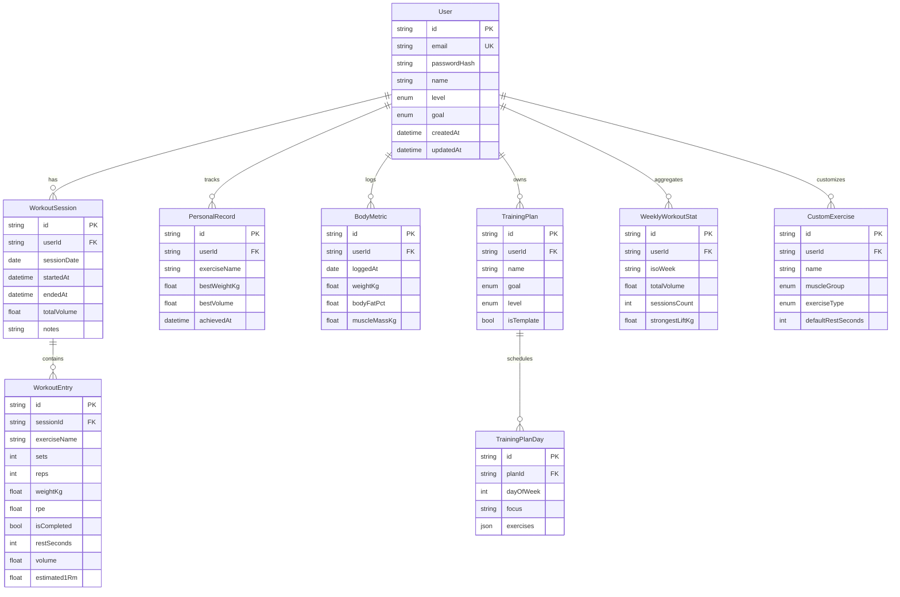

# 2) Database Schema (ERD)

Schema source of truth: `apps/api/prisma/schema.prisma`.

## Notes

- PR detection uses `PersonalRecord` (`bestWeightKg`, `bestVolume`).
- Estimated 1RM uses Epley formula per workout entry.
- `WeeklyWorkoutStat` is pre-aggregated for fast dashboard/progress charts.
